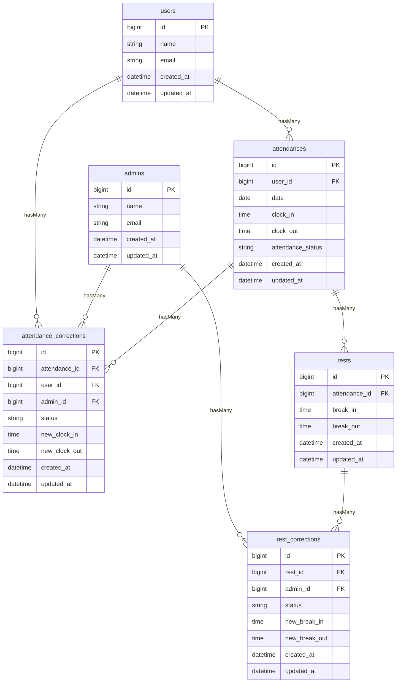

# coachtech 勤怠管理アプリ

## 環境構築

## 使用技術

## ER図

```mermaid
    erDiagram

    users ||--o{ attendances : "hasMany"
    users ||--o{ attendance_corrections : "hasMany"

    admins ||--o{ attendance_corrections : "hasMany"
    admins ||--o{ rest_corrections : "hasMany"

    attendances ||--o{ rests : "hasMany"
    attendances ||--o{ attendance_corrections : "hasMany"

    rests ||--o{ rest_corrections : "hasMany"

    admins {
        bigint id PK
        string name
        string email
        datetime created_at
        datetime updated_at
    }

    users {
        bigint id PK
        string name
        string email
        datetime created_at
        datetime updated_at
    }

    attendances {
        bigint id PK
        bigint user_id FK
        date date
        time clock_in
        time clock_out
        string attendance_status
        datetime created_at
        datetime updated_at
    }

    rests {
        bigint id PK
        bigint attendance_id FK
        time break_in
        time break_out
        datetime created_at
        datetime updated_at
    }

    attendance_corrections {
        bigint id PK
        bigint attendance_id FK
        bigint user_id FK
        bigint admin_id FK
        string status
        time new_clock_in
        time new_clock_out
        datetime created_at
        datetime updated_at
    }

    rest_corrections {
        bigint id PK
        bigint rest_id FK
        bigint admin_id FK
        string status
        time new_break_in
        time new_break_out
        datetime created_at
        datetime updated_at
    }
```

## URL

- 開発環境：
- phpMyAdmin:
